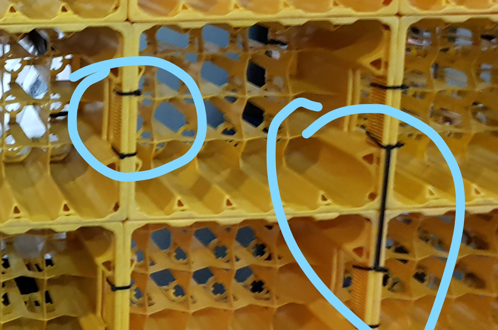

# BalcCon_Video_Wall

First built at the BalcCon2k17 conference in Novi Sad, Serbia, this project is meant to be as easy to build as possible.
This project grew by the community and is meant to provide people who would like to recreate it with a starting guide.

This BalcCon Video Wall installation was designed with the following priorities in mind:
- Cost effective as possible
- Minimal use of special equipment (some soldering required)
- Easy and fast to deploy and dismantle
- Having fun building it

The following project was the inspiration for the BalcCon Video Wall.
https://github.com/jaseg/matelight

# Overview

The base for the wall consists of 8x15 0.5l bottle crates (each crate holding 4x5 bottles). The crates provide stability and if only needed temporarely, might be borrowed or rented at a local beverage supplier. 2400 seperately adressable LEDs (Type WS2811), controlled by a single Teensy 3.2 microcontroller board on a OctoWS2811 adapter.
The OctoWS2811 supports 8 channels, so in this setup, each row of crates corresponds to one channel.

# Hardware BoM

| Part                                                                          | Cost per Unit | Link | Amount | Total Cost |
|-------------------------------------------------------------------------------|--------------:|:----:|:------:|-----------:|
| LED Strips: 5V, 50pcs, 12mm WS2811 Square Pixels                              |            16 | [LINK](https://www.aliexpress.com/item/32803645847.html?spm=a2g0o.productlist.0.0.441f20e1bwosun&algo_pvid=5711eaf1-4cf0-4df9-9c0d-b2274c4a2ce6&algo_expid=5711eaf1-4cf0-4df9-9c0d-b2274c4a2ce6-0&btsid=1dc6b135-e73a-4c0d-975e-c16f1bc40198&ws_ab_test=searchweb0_0,searchweb201602_8,searchweb201603_60) |   48   |     768.00 |
| Power Supply: 5V, 60A, 300W Power Supply                                      |            27 | [LINK](https://www.banggood.com/AC-110-220V-To-DC-5V-60A-300W-Driver-Switch-Power-Supply-Transformer-For-LED-Strip-Light-p-1094564.html?rmmds=search&cur_warehouse=CN) |    4   |     108.00 |
| Teensy 3.2                                                                    |         22.80 | [LINK](https://www.pjrc.com/store/teensy32_pins.html) |    1   |      22.80 |
| Teensy 3.2 OctoWS2811 Adaptor                                                 |         10.00 | [LINK](https://www.pjrc.com/store/octo28_adaptor.html) |    1   |      10.00 |
| Stereo Speaker Wire (used as power cables)                                    |           0.2 | [LINK]() |   40   |       8.00 |
| Wire Connectors 10pcs  (with 3 or 4 connections)                              |          1.77 | [LINK](https://www.aliexpress.com/item/32875751312.html?spm=a2g0s.8937460.0.0.62c62e0eZ1zAF1) |    3   |       5.31 |
| Lots of 4x300mm Zip-Ties (100pcs/lot)                                           |          3.34 | [LINK](https://www.aliexpress.com/item/33046656080.html?spm=a2g0o.productlist.0.0.457711abtB9bWJ&algo_pvid=d6c8c6b9-2f94-4266-99e1-77a1d78349ad&algo_expid=d6c8c6b9-2f94-4266-99e1-77a1d78349ad-6&btsid=723c11c6-0c6e-4ee4-8d97-53ee8c822230&ws_ab_test=searchweb0_0,searchweb201602_8,searchweb201603_60) |   10   |      33.40 |
| White Papers 24cm x 27cm (custom cut)  alternatively use any paper available  |           N/A |      |  2400  |            |
| Ratchet Strap Tie (to secure the wall)                                        |          7.43 | [LINK](https://www.aliexpress.com/item/33047604146.html?spm=a2g0o.productlist.0.0.1c057175My65AY&algo_pvid=0357540a-9835-4c6c-a21b-befc95663585&algo_expid=0357540a-9835-4c6c-a21b-befc95663585-1&btsid=2904f696-ae21-451b-8135-08546c64ef44&ws_ab_test=searchweb0_0,searchweb201602_8,searchweb201603_60) |    3   |      22.29 |
| Empty Bottle Crates (4x5) with a center hole!                                 |           N/A |      |   120  |            |
| Baking Paper 20pcs (white, used as diffusors)                                 |          2.69 | [LINK](https://www.aliexpress.com/item/32965656584.html?spm=a2g0s.8937460.0.0.62c62e0eZ1zAF1) |    6   |      16.14 |
|                                                                               |               |      |  TOTAL |     993.94 |

# Building

## Crate Base

Lay out the first 15 crates on the ground and connect each crate to the next. It might be a good idea, to assemble the first row at the final position of the wall, as moving it at the end is kind of tricky.
Once you are happy with the position of the wall, start with the second row. Attach each crate you add not only with the one next to it but also with the one below. 
You might need to use two zipties in the front to connect the two layers with eachother.

## Adding that LED goodness

Once the wall stands, attach the LEDs in the back. Be sure, to mount them correctly as shown in the following image:

